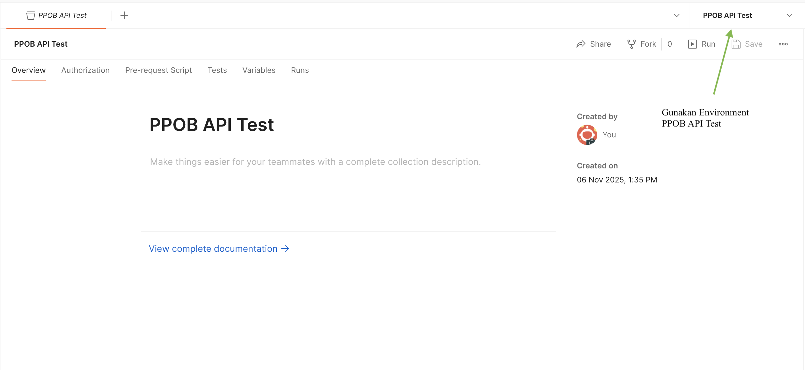
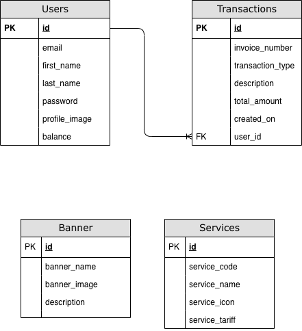

# PPOB RESTful API

Sebuah RESTful API sederhana untuk layanan **Payment Point Online Bank (PPOB)**.  
API ini menyediakan fitur **registrasi pengguna, autentikasi JWT, top up saldo, pembayaran layanan (seperti listrik, pulsa, air, dsb), dan riwayat transaksi**.

---

## Fitur Utama

- **Autentikasi JWT** (Login & Register)
- **Top Up Saldo**
- **Pembayaran Layanan (Payment)**
- **Riwayat Transaksi (History)**
- **Manajemen Profil Pengguna**
- **Upload Avatar dengan Multer**
- **PostgreSQL Database**
- **Migration dengan Node-PG-Migrate**

---

## Tech Stack

| Layer | Teknologi |
|-------|------------|
| Runtime | Node.js (v18+) |
| Framework | Express.js |
| Database | PostgreSQL |
| ORM / Migration | node-pg-migrate |
| Auth | JSON Web Token (JWT) |
| Upload | Multer |
| Utils | nanoid, bcrypt, dotenv |

---

## Instalasi

### 1. Clone Repositori
```
git clone https://github.com/nazaralwi/NutechTakeHomeTest.git
cd NutechTakeHomeTest
```

### 2. Install Dependency
```
npm install
```

### 3. Buat File .env
```
# Server Configuration
HOST=localhost            # Host tempat server dijalankan (contoh: localhost atau 0.0.0.0)
PORT=3000                 # Port untuk server Express (contoh: 3000)

# Database Configuration (PostgreSQL)
PGUSER=your_db_user       # Username PostgreSQL (contoh: postgres)
PGHOST=localhost          # Host PostgreSQL (contoh: localhost atau IP VPS)
PGPASSWORD=your_db_pass   # Password PostgreSQL
PGDATABASE=your_db_name   # Nama database (contoh: ppob_db)
PGPORT=5432               # Port default PostgreSQL (biasanya 5432)

# JWT Configuration
JWT_SECRET=your_jwt_secret_key     # Secret key untuk menandatangani token JWT
JWT_EXPIRES_IN=12h                 # Waktu kadaluarsa token JWT (contoh: 1h, 1d, 7d)

# Internal Key
INTERNAL_KEY=your_internal_api_key # Kunci khusus untuk endpoint internal (misal /reset)
```

### 4. Jalankan Migration
Patikan Anda sudah memasang [PostgreSQL](https://www.postgresql.org/download/) di komputer Anda.

Jalankan perintah berikut.
```
npm run migrate up
```

### 5. Jalankan Server
```
npm run dev
```

Server akan berjalan di:
`http://localhost:3000`

## Autentikasi

Gunakan Bearer Token JWT di setiap endpoint yang membutuhkan autentikasi.

Header:

```
Authorization: Bearer <token>
```

Token akan didapatkan dari endpoint Login.

# Daftar Endpoint API

## Auth
| Method | Endpoint | Deskripsi | Status |
|---------|-----------|------------|---------|
| `POST` | `/registration` | Registrasi pengguna baru | **Public** |
| `POST` | `/login` | Login dan mendapatkan JWT token | **Public** |

---

## User
| Method | Endpoint | Deskripsi | Status |
|---------|-----------|------------|---------|
| `GET` | `/profile` | Mendapatkan profil pengguna | **Private** |
| `PUT` | `/profile/update` | Mengupdate profil pengguna | **Private** |
| `PUT` | `/profile/image` | Upload foto profil (avatar) | **Private** |

---

## Transaction
| Method | Endpoint | Deskripsi | Status |
|---------|-----------|------------|---------|
| `GET` | `/balance` | Mendapatkan saldo pengguna | **Private** |
| `POST` | `/topup` | Top up saldo pengguna | **Private** |
| `POST` | `/transaction` | Melakukan transaksi | **Private** |
| `GET` | `/transaction/history?offset=0&limit=3` | Melihat riwayat transaksi (opsional offset dan limit) | **Private** |

---

## Service
| Method | Endpoint | Deskripsi | Status |
|---------|-----------|------------|---------|
| `GET` | `/banner` | Mendapatkan daftar banner | **Public** |
| `GET` | `/services` | Mendapatkan daftar layanan yang tersedia | **Private** |

---

## ⚠️ Internal (Hanya untuk tahap development)
| Method | Endpoint | Deskripsi | Status |
|---------|-----------|------------|---------|
| `POST` | `/internal/reset` | Membersihkan databases | **Internal** — gunakan header `x-internal-secret` |

---

### Catatan
- **Public** → dapat diakses tanpa autentikasi.  
- **Private** → membutuhkan header `Authorization: Bearer <JWT_TOKEN>`.  
- **Internal** → hanya untuk keperluan development, memerlukan header `x-internal-secret`.  

## Postman Collection dan Enviroment
Ketika membangun PPBO RESTful API, tentu Anda perlu menguji untuk memastikan API berjalan sesuai dengan kriteria yang ada. Kami sudah menyediakan berkas Postman Collection dan Environment yang dapat Anda gunakan untuk pengujian. Berkasnya kami simpan di dalam folder [`/postman`](https://github.com/nazaralwi/NutechTakeHomeTest/tree/master/postman).

### Cara Import Collection dan Environment PPOB RESTful API
1. Buka aplikasi Postman.
2. Klik tombol Import yang berada di bagian atas panel kiri Postman.
3. Pilih opsi Upload Files.
4. Pilih kedua berkas pada folder [`/postman`](https://github.com/nazaralwi/NutechTakeHomeTest/tree/master/postman) (Collection dan Environment), lalu klik Open.
5. Setelah file berhasil dipilih, klik tombol Import.
6. Sekarang, PPOB API Test Collection dan PPOB API Environment akan muncul di Postman Anda.
7. Pastikan untuk mengaktifkan Environment PPOB API sebelum melakukan pengujian endpoint.

8. Sesuaikan value pada Environment PPOB API. Misal gunakan `http://localhost:3000` sebagai `baseUrl`.
9. Pastikan untuk melakukan konfigurasi Working Directory (Settings > General > Working Directory) untuk pengujian unggah berkas.


Pengujian dengan Postman ini hanya digunakan ketika program dijalankan di lingkungan `development` (npm run dev).

## Design Database
Tabel yang berelasi hanya tabel `users` dan `transactions`.

Sementara untuk table `banner` dan `services` belum diketahui relasinya. Perlu ada diskusi terlebih dahulu.


